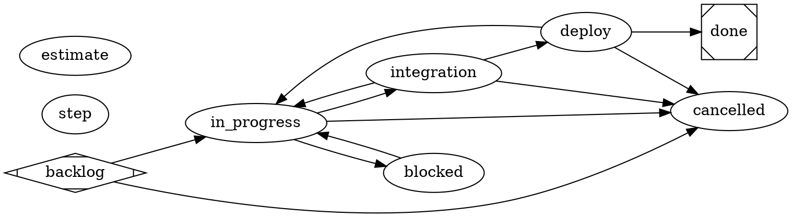

# portside workflow — in-loop, commit/push then local docker deploy

The lifecycle is the **DOT graph** below — read it as the authority; this prose
only orients and must not restate it. Each node is a step carrying an `agent`.
This workflow is **reviewer-only for execution**: `in_progress`, `integration`,
and `deploy` carry `agent=executor`, so the **in-loop driving session** performs
them with full context and the session's own permissions — no isolated
sub-process is spawned for coding, commit, push, or deploy. A **reviewer** node
only gates *entry* (read-only — it judges, never mutates).

The three performing phases, in the repo's required order:

- `in_progress` — implement the slice and its tests in-loop.
- `integration` — **commit and push** the slice.
- `deploy` — **local docker deploy/update**: build the image from the committed
  tree, bring the compose stack up on `127.0.0.1:8888`, and probe it before
  `done`.

`integration -> in_progress` and `deploy -> in_progress` are recovery edges: a
reject returns the story to work to fix and re-traverse, never bypass. `blocked`
is a park state (world-not-ready, same ACs on resume). `done`/`cancelled` are
terminal.



## Skill resolution

Every gate/skill this workflow names resolves through the doc-index, project
scope (`.satelle/skills`) layered over the embedded system defaults. This lean
workflow references only skills that resolve from the **embedded system
defaults**, so there is no dangling reference and a story drives to a terminal
state without a missing-skill block:

- `satelle-story-cancel-review` — the cancel gate.
- `satelle-story-blocked-review` — the park gate on `in_progress → blocked`.
- `satelle-step-summary` — per-transition step summaries.
- `satelle-estimate-actual-review` — gates begin-work + close.

## Environment

```yaml
guardrails:
  always:
    - Drive an engaged item to a terminal state (done or cancelled) — don't leave work open indefinitely.
    - Give a story numbered acceptance criteria before starting, and satisfy them before moving to done.
    - Perform in_progress, integration, and deploy IN-LOOP as the driving session; do not dispatch an isolated sub-process for coding, commit, push, or deploy.
    - Order is fixed: implement in_progress, then commit/push in integration, then the local docker deploy/update in deploy.
    - Prove the local docker deploy (build the image, compose up on 127.0.0.1:8888, probe it) before done.
  ask_first: []
  never:
    - Place any state after done — done is always the terminal success state.
    - Bind or expose the service on anything but 127.0.0.1.
    - Delete a stack's volumes — delete removes containers and the compose network only.
    - Mark an item done with unmet acceptance criteria.
```
